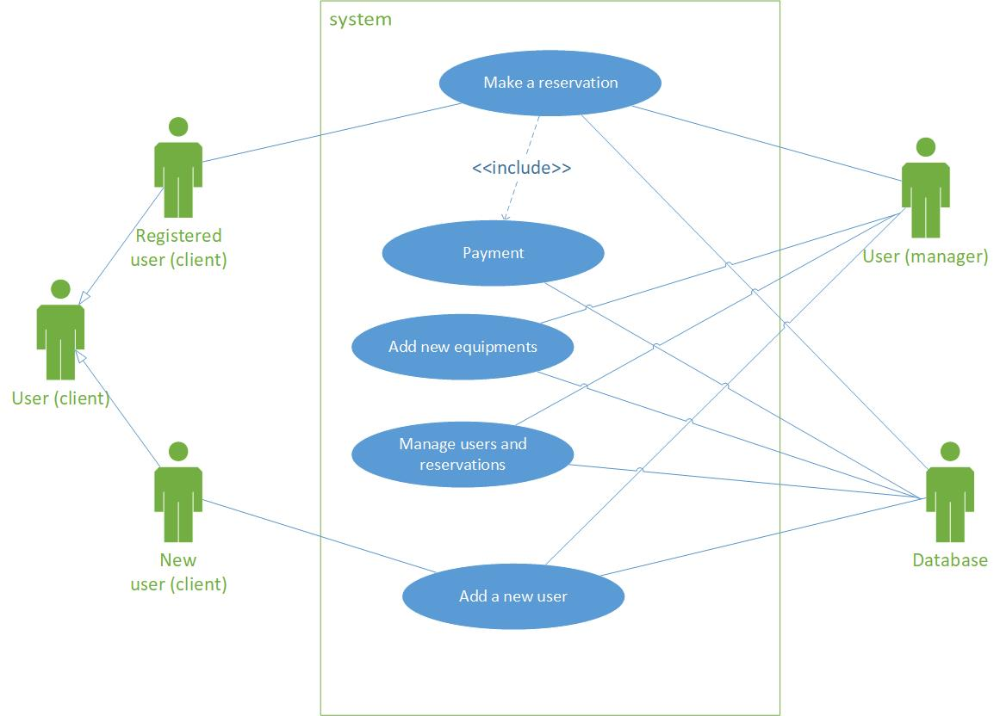
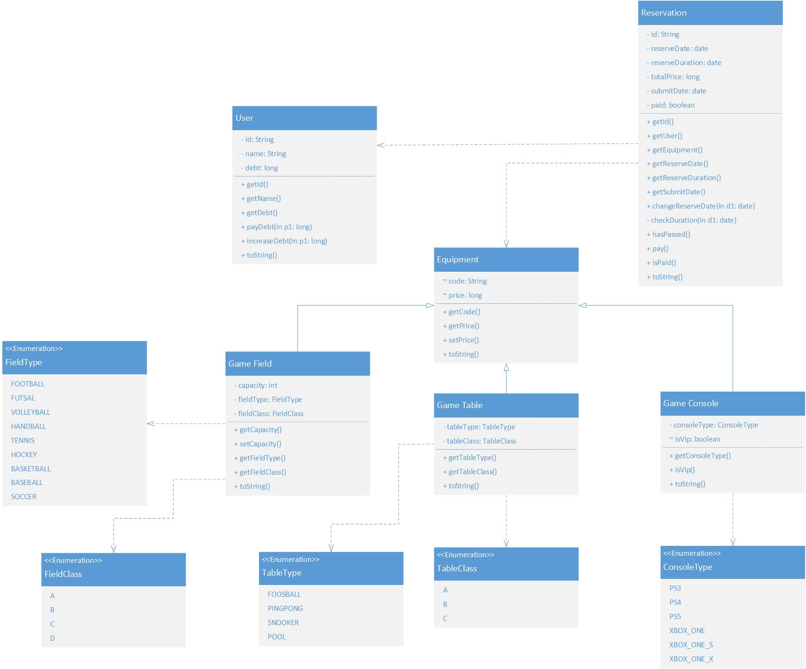
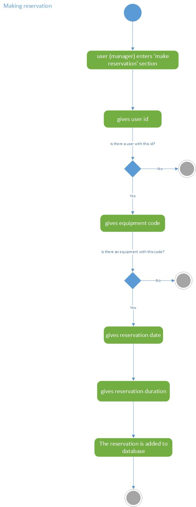
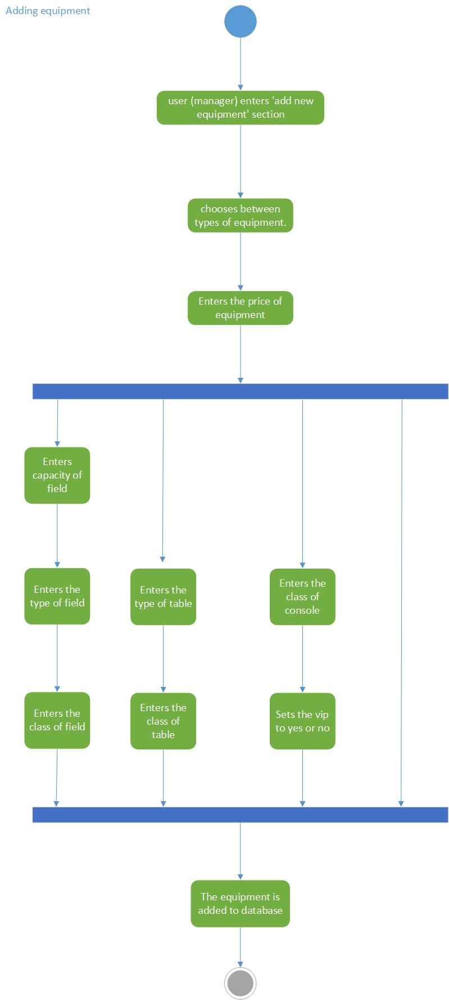
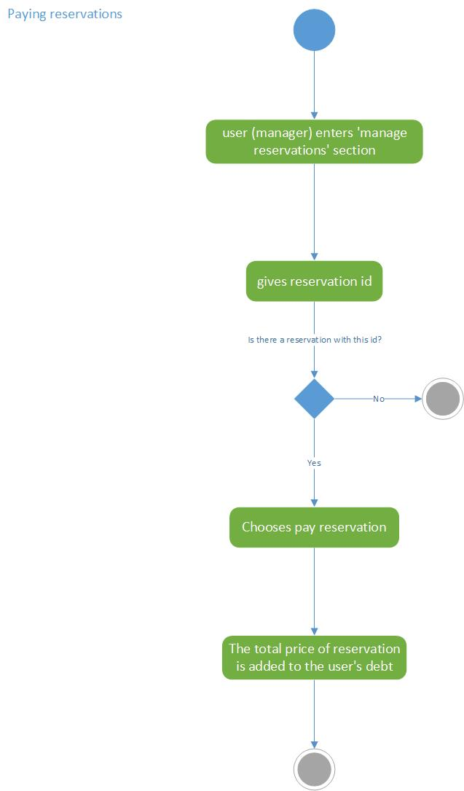

# Sports club management system

This is a java project that I made for my object-oriented design course in college.

### use case diagram

### class diagram

### activity diagrams

- Activity diagram 1

- Activity diagram 2

- Activity diagram 3

